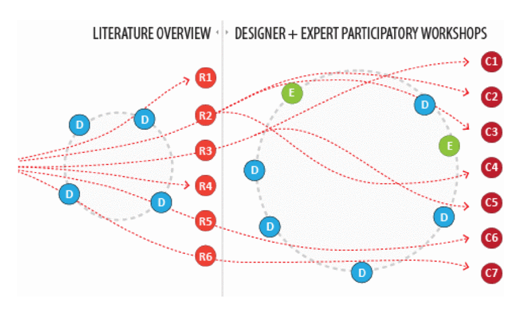
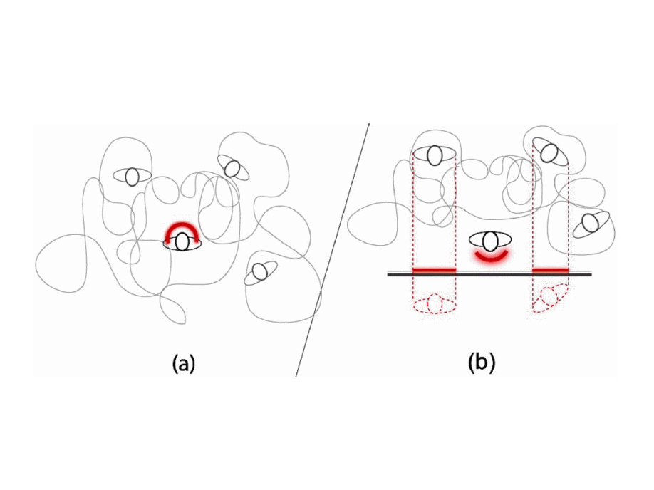
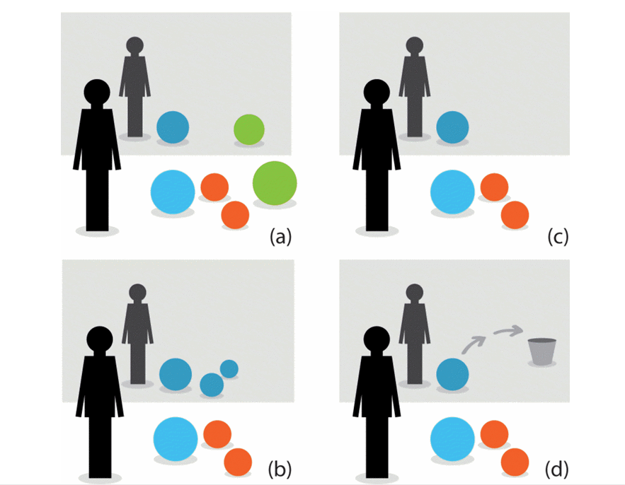

Diminished Reality Spaces

Ben Miller

[[Attention affected by Environment - All]]
[[Attention & Interfacing with Devices - All]]
[[Attention - All]]

[Article](https://ieeexplore.ieee.org/abstract/document/7344759?casa_token=NVceMcG0x4IAAAAA:ESE3lc-tiTvd9WzoZzYtHxGrCpW7RPPQoX4LHKfwiD_wB2JXtv32a8R6QLjsP4I1oMj8fgWi8g)

# Introduction

Emerging technologies increase distraction due to the high number of displaying surfaces and increased amounts of data around us. In our everyday lives, we encounter many distracting factors. Pointing out the relevance of attentive user interfaces (AUIs) by referring to the fact that our attention is a limited resource, Vertegaal [24] claims that we may better manage our attention by using technologies sensing, analyzing, and keeping track of our surroundings and ourselves. In this sense, AUIs are seen as systems tracking factors in the environment such as proximity, orientation, or verbal communication. Some of these studies follow a Diminished Reality (DR) approach for filtering out the information we receive before it reaches our sensory system. While most AUI solutions have been intended for HCI, recently it has also started to be addressed for human-human interaction (HHI) as well. These advances provide some playful and experimental novel opportunities for interaction design.

[augmented reality](https://www.fi.edu/what-is-augmented-reality) and how it can be utilized to [[Directing Visual Attention with AR - Ben| direct users' visual attention]]. Diminished reality spaces, in contrast, aim to reduce the distracting visual incidents and continously changing surroundings which adversely affect individuals with [autism spectrum disorder (ASD)](https://www.cdc.gov/ncbddd/autism/facts.html).  

As already mentioned, HCI researchers have investigated intelligent technologies for improved work performance with a special interest in human factors. Besides a focus on sensory and attention processes, we see an opportunity to make interactive devices smart enough to watch our needs and provide information whenever necessary. Human factor research has been dealing with this problem over the last decade under the name of attentive user interfaces (AUI). Human factors and disabling environment design are broad subjects with many alternative approaches. Here, we focus on the following three research issues: (a) Filtering from the general subject of AUIs; (b) augmenting users' visual attention, and (c) interactive assistive technologies for individuals with attention disorders.

An early AUI study by Vertegaal [24] refers to the groundbreaking motto of the famous architect Mies Van Der Rohe, “less is more” to explain the need for smart interactive devices observing and communicating our attention in an economic way. For mediating and refining sound before it reaches our brain, literature has several different solutions such as smart headphones [2] or transparent hearing [16]. But as mentioned by Liebl et al. [15], visual distraction has been surprisingly unexplored until the last decade. Recently though, the topic seems to have reappeared within human factor and work performance studies [6], [15], [22]. Refining visual distractions is needed in any work-related task because it affects reasoning, searching and detection abilities directly. Most eye-tracking research studies and scenarios focus on tasks related to visual search and detection of objects.

there are many reasons for augmenting visual attention. For example, it might be needed when dealing with large sets of information using small displays, or when there is a huge display in front but focus on specific content is needed

Toet [25] points out that applications of such technologies are related to critical work fields such as flight, medicine, driving simulation, virtual reality, remote piloting and tele-operation, infrared and indirect vision, image transmission and retrieval, telemedicine video tele-conferencing and artificial vision systems

enhance visual capacity by refining the view or content according to the limitations of the user; (a) Non-distortion oriented techniques; (b) Distortion-oriented techniques; (c) Hybrid techniques: Magic lens filters; (d) Multiple screens; (e) Gaze contingent multi-resolution displays; (f) Gaze contingent stereoscopic displays; (g) Gaze contingent attention guiding displays. As already mentioned, within these techniques gaze-contingent solutions have been the most popular, as an extension of the emerging interest in eye tracking in which the system tracks gaze and reduces the detail of the image left out of focus

The previously discussed studies on AUIs aim to help ameliorate workplace attention problems. We are all affected by disabling situations but to a lesser extent than individuals with particular perception and cognition structures, such as the ones diagnosed with dyslexia, ASD, ADHD, and so on. It is claimed that dyslexic individuals suffer from not being able to select information effectively rather than mis-encoding [8]. By using the information that a dyslexic individual's visual awareness can receive a limited amount of the encoded information by the eye, Roach [21] suggested that filtering the irrelevant visual information before it reaches the eye would help. He examined searching and filtering functions used while reading and reached some valuable information such as the positive effect of cueing.

It is known that technology can help the education, rehabilitation and the daily life process of individuals with ASD. While attention-challenged individuals suffer from disabilities in communication, socialization and imagination, some autistics are good with structural information processing [1] and focusing on specific things. This makes them potentially good users of machines and technology [3]. Some other facts about individuals with ASD are that they have better visual than auditory perception [10], and different types of autistics have different visual representation abilities (objects, realistic image, realistic illustrations, text). All of these facts are significant clues for an interactive solution aimed at the varied visual needs of ASD individuals. Altogether, considerable work has been focused on technological solutions for improving the quality of life for autistics using mechanical and visual abilities. Leaving the rehabilitation and educational methods apart, daily life solutions mostly concentrate on helping with communication abilities.

# Method

possible AUI solutions for enhancing everyday life process of individuals with ASD. With this perspective, we started examining interactive technologies for individuals with ASD, the fields of AUI and augmentation of visual attention. Examining the relevancy of AUI for ASD rounded off the literature review

After the extensive literature overview we organized eight design workshops (Fig. 3) with interaction designers and ASD domain experts (rehabilitators, caretakers, and family members of individuals with ASD) who will also be potential users of such solutions when accompanying an ASD individual. During a period of two months we carried out eight sequential workshops. For each workshop we invited new participants; always five interaction designers and two ASD experts. At the start of each workshop we briefed the participants with insights from our literature review. These workshops benefited our exploration by examining novel ways of bringing our research problem closer to current HCI solutions.

[Diagram Source](https://ieeexplore-ieee-org.ezproxy.library.uvic.ca/document/7344759)

[Diagram Source](https://ieeexplore-ieee-org.ezproxy.library.uvic.ca/document/7344759)

[Attentive User Interfaces (AUIs)](https://interruptions.net/literature/Vertegaal-CACM03-p30-vertegaal.pdf)

# Approach

These studies led us to the question; why not build a space where the information is projected onto surfaces and objects (Fig. 1)? Such a system would keep track of the state of the room and needs of the user, and use DR techniques like filtering irrelevant information to augment the user's attention depending on given sets of information. We believe that this might be a natural way of assisting communication without adding barriers. In detail, we explored the concept regarding content filtering and guidance (Figs. 4–5), reflecting proxemics information (Figs. 6–7) and spatial design (Fig. 8).

In terms of content filtering (Fig. 4), the “mirror-wall” concept can (a) filter out irrelevant contents by which an ASD individual is affected in the work environment, (b) reflect the irrelevant contents as if they are relevant, (c) only reflect the relevant contents which the ASD individual needs or wants, or (d) only reflect the contents which guide the ASD individual to carry out specific actions. The latter function is illustrated in detail in Fig. 5 which shows the mirror-like wall guiding an ASD individual to perform next steps of his/her actions in a personal or social setting such as clearing the table or greeting someone.

## The "Mirror-Wall"

[Diagram Source](https://ieeexplore-ieee-org.ezproxy.library.uvic.ca/document/7344759)

test

[[Attentive User Intefaces - Mahum]]

[[Attention affected by Environment - All]]