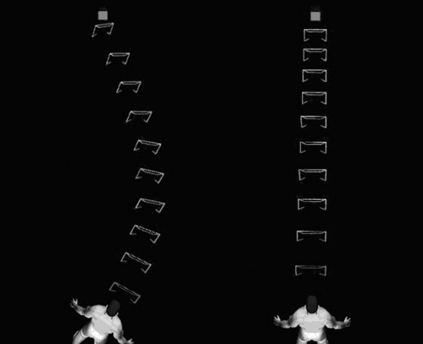

Directing Visual Attention with AR

[[Attention affected by Environment - All]]
[[Attention & Interfacing with Devices - All]]
[[Attention - All]]

Main approach:

Assumptions they use to achieve cognitive augmentation: Extended wireless network topology

Diagrams

[Article](https://www.tandfonline.com/doi/abs/10.2753/MIS0742-1222230408?casa_token=PXHug6pj6U4AAAAA:miysc_ERphWaHMeO3wXmedYLuyELmEp1n_5HQNStOEt9Llvr7qERegqfEELMebTWXefhY2bWFymP)

WITH THE EVOLUTION OF MOBILE COMPUTER SYSTEMS, there is a tighter and more ubiquitous integration of the virtual information space with physical space. For example, the use of databases marked by geospatial data or radio frequency identification (RFID) tagging and mobile displays enable potential integration of virtual information and physical assets—the two are dynamically linked.

Of current interfaces, the most suited to mobile geospatial information display is augmented reality (AR). AR systems allow users to be aware of perfectly spatial registered information from simple two-dimensional (2D) labels to three-dimensional (3D) labels or virtual markers

AR techniques allow users to see buildings, objects, and tools superimposed with computer-generated virtual annotations. Unlike its cousin virtual reality (VR), AR enhances the real environment rather than replacing it with computer-generated imagery. Graphics are superimposed on the user’s view of the real environment.

One of the most promising applications of AR is the display of computer-generated information to guide the work of a user to specific spatial locations such as buildings, tools, packages, and other assets tracked by database systems. The ability to overlay and register any type of information on the working environment in a spatially meaningful way allows AR to be a more effective medium for information display.

Studies of user performance in AR-based information systems indicate that they can provide unique human factors benefits—as compared to approaches using traditional printed manuals or other computer-based approaches—such as improved task performance, decreased error rates, and decreased mental workload [34, 35, 36].

Information objects such as labels, overlays, 3D objects, and other information are integrated into the physical environment. Objects, tasks, and locations can be cued when appropriate to support navigation and mobile active user tasks.

Increased network access via heterogeneous wireless network topologies enables mobile users to have “anytime, anywhere” access of information for work and personal communication [6].

Attention Funnel 