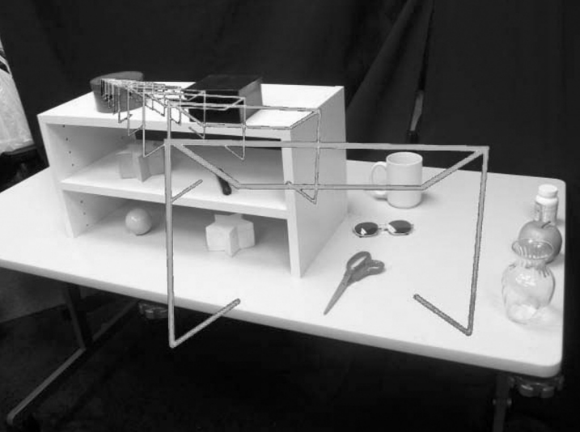
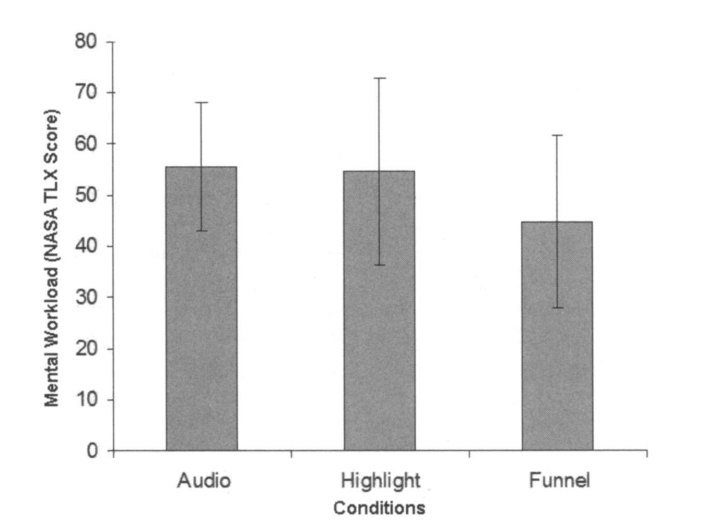
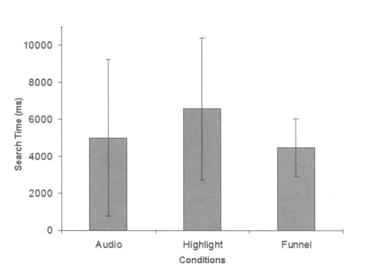
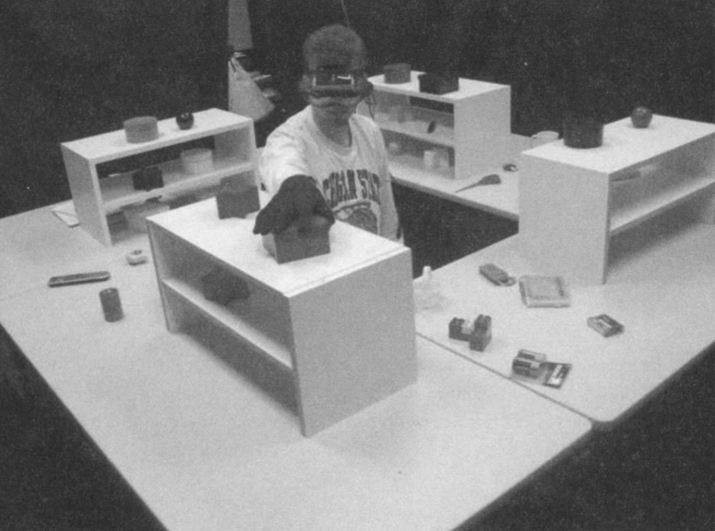

Directing Visual Attention with AR

[[Attention affected by Environment - All]]
[[Attention & Interfacing with Devices - All]]
[[Attention - All]]

Main approach:

Assumptions they use to achieve cognitive augmentation: Extended wireless network topology

Diagrams

[Article](https://www.tandfonline.com/doi/abs/10.2753/MIS0742-1222230408?casa_token=PXHug6pj6U4AAAAA:miysc_ERphWaHMeO3wXmedYLuyELmEp1n_5HQNStOEt9Llvr7qERegqfEELMebTWXefhY2bWFymP)

# INTRO + MAIN APPROACH

WITH THE EVOLUTION OF MOBILE COMPUTER SYSTEMS, there is a tighter and more ubiquitous integration of the virtual information space with physical space. For example, the use of databases marked by geospatial data or radio frequency identification (RFID) tagging and mobile displays enable potential integration of virtual information and physical assets—the two are dynamically linked.

Of current interfaces, the most suited to mobile geospatial information display is augmented reality (AR). AR systems allow users to be aware of perfectly spatial registered information from simple two-dimensional (2D) labels to three-dimensional (3D) labels or virtual markers

AR techniques allow users to see buildings, objects, and tools superimposed with computer-generated virtual annotations. Unlike its cousin virtual reality (VR), AR enhances the real environment rather than replacing it with computer-generated imagery. Graphics are superimposed on the user’s view of the real environment.

One of the most promising applications of AR is the display of computer-generated information to guide the work of a user to specific spatial locations such as buildings, tools, packages, and other assets tracked by database systems. The ability to overlay and register any type of information on the working environment in a spatially meaningful way allows AR to be a more effective medium for information display.

Studies of user performance in AR-based information systems indicate that they can provide unique human factors benefits—as compared to approaches using traditional printed manuals or other computer-based approaches—such as improved task performance, decreased error rates, and decreased mental workload [34, 35, 36].

Information objects such as labels, overlays, 3D objects, and other information are integrated into the physical environment. Objects, tasks, and locations can be cued when appropriate to support navigation and mobile active user tasks.

Increased network access via heterogeneous wireless network topologies enables mobile users to have “anytime, anywhere” access of information for work and personal communication [6].

Three basic patterns are used to construct a funnel: (A) the head-centered plane includes a bore-sight to mark the center of the pattern from the user's viewpoint; (B) funnel planes, added in a fixed pattern (approximately every 0.2 meters) between the user and the object; and (C) the object marker pattern, which includes crosshairs marking the approximate center of the object. mechanism for drawing visual attention to locations, information, or paths in an AR environment. The basic components of the attention funnel, as illustrated in Figure 2, are 1. a view plane with a virtual bore-sight in the center and a pointer arrow above; 2. a dynamic set of increasingly smaller funnel planes; 3. 3D "crosshairs" targeting the object location; and 4. a curved, dynamic path (see Figures 1 and 3) linking the head or viewpoint of the user and all the elements directly to the object. Along the curved dynamic path, the funnel planes are repeated in space and normal to the line. We refer to this line and the repeated patterns as an attention funnel. The path drawn for near objects is defined by a [Hermite curve](https://inspirit.net.in/books/academic/Computer%20Graphics%20C%20Version%20-%20Hearn%20&%20Baker.pdf). A Hermite curve is a cubic curve segment defined by a start location, end location, and derivative vectors at each end. The curve follows a path from the starting point in the direction of the starting end derivative vector. It ends at the end point with the curve approaching the end point in the direction of the derivative vector. As a cubic curve segment, the curve presents a smoothly changing path from the start point (i.e., the user's view plane) to the end point (i.e., the 3D "crosshairs" target) with curvature controlled by the magnitude of the derivative vectors. Hermite curves are a standard cubic curve method. Figure 3 clearly illustrates the curvature of the funnel from a bird's-eye view. The start point for the Hermite curve is located at a specified distance in front of the origin in a frame defined to be the viewpoint of the user (the center of projection for a single viewpoint or average of two viewpoints for stereo viewers). The curve terminates at the target. The curve is a cubic interpolating curve that creates a smoothly varying path from start to target.

## The Attention Funnel

The attention funnel uses various overlapping visual cues that guide body rotation, head rotation, and gaze direction of the user. Building on an attention sink pattern introduced by Hochberg [11], the attention funnel uses strong perspective cues

Attention Funnel [Image Source](https://www-tandfonline-com.ezproxy.library.uvic.ca/doi/pdf/10.2753/MIS0742-1222230408?needAccess=true)

Attention Funnel Real World View [Image Source](https://www-tandfonline-com.ezproxy.library.uvic.ca/doi/pdf/10.2753/MIS0742-1222230408?needAccess=true)

Does the attention funnel truly direct user attention more efficiently than the most common techniques used in current AR interfaces? We conducted a study to evaluate the effectiveness of the attention funnel in guiding attention around the immediate space of the user.

A common task for an AR cursor system in a mobile setting is to guide a (user to an object that the user needs to retrieve in the immediate environment. The attention funnel paradigm was tested against two alternative techniques: (1) a commonly used AR highlighting technique, where the target object is cued by a surrounding green bounding box, and (2) a control condition mimicking interpersonal interaction, where the object to be found is indicated only by its name (e.g., "pick up the screwdriver"). A 360-degree omnidirectional workspace was created using four tables as shown in Figure 5. Forty-eight objects were distributed over the four tables (12 objects each). Half of these objects were primitive geometric objects of different colors and the other half recognizable tools (e.g., screwdriver, stapler, and no.

 Methodology A within-subjects experiment was conducted to test the performance of the atten- tion funnel design against other conventional attention direction techniques - visual highlighting and verbal cues. The experiment had one independent variable, the method used for directing attention, with three alternatives: (1) the attention funnel, (2) visual highlight techniques, and (3) a control condition consisting of a simple linguistic cue common in current mobile phones (i.e., "look for the red box.") Participants Fourteen paid participants drawn from a university student population participated in the study.
 
 Visual Highlight Condition For the visual highlight interface, a 3D bounding box was placed so as to appear spatially registered at the location of the target object. Audio Instruction Condition For the audio instruction condition, visual search was directed by playing a prerecorded audio description of the target object for the user via a pair of headphones (e.g., "Please grab the [item]"). Each audio cue took approximately 1.5-2 seconds to play.
 
 A 360-degree omnidirectional workspace was created using four tables as shown in Figure 5. Twelve objects were placed on each table: six primitive objects of different colors (e.g., red box, black sphere) on a shelf, and six general objects (e.g. stapler, notebook) on the tabletop. Visual cues were displayed in stereo with the Sony Glasstron LDI-100B HMD, and audio stimulus materials were presented with a pair of headphones. Head motion This content downloaded from 142.104.240.194 on Sun, 31 Oct 2021 20:52:37 UTC All use subject to https ATTENTION ISSUES IN SPATIAL INFORMATION SYSTEMS 1 77 was tracked by an Intersense IS-900 ultrasonic/inertia hybrid tracking system. Stereo graphics were rendered in real time based on the data from the tracker. A pressure sensor was attached to the thumb of a glove to capture the reaction time when the subject grasped the target object. Presentation of stimulus materials, audio instructions for participants, experimental procedure sequencing, and data collection for the experiment were automated so that the experimenter did not need to manually record the experimental results. The experi- ment was developed in the ImageTclAR AR development environment [27]. Measurements Search Time, Error, and Variability Search time in milliseconds was measured as the time it took for participants to grab a target object from among the 48 objects following the onset of an audio cue tone. The end of the search time was triggered by the pressure sensor on the thumb of the glove when the user touched the target object. An error was logged for cases when participants selected the wrong object. Mental Workload Participants' perceived task workload in each condition was measured using the NASA Task Load Index after each experimental condition [9].
 
 
 [Diagram Source](https://www-tandfonline-com.ezproxy.library.uvic.ca/doi/pdf/10.2753/MIS0742-1222230408?needAccess=true)
 
 [Diagram Source](https://www-tandfonline-com.ezproxy.library.uvic.ca/doi/pdf/10.2753/MIS0742-1222230408?needAccess=true)
 
 # Results 
 
  A general linear model repeated measure analysis of variance (ANO VA) was con- ducted to test the effect of metaphors on the different performance indicators. There was a significant effect of interface type on search time, F(2, 1 3) = 1 0.03 l,p< 0.00 1 , and on search time consistency (i.e., smallest standard deviation), F(2,13) = 23.066, p < 0.000. The attention funnel interface clearly allows subjects to find objects in the least amount of time and with the most consistency (mean [M] = 4473.75 milliseconds [ms], standard deviation [SD] = 1064.48) compared to the visual highlight interface This content downloaded from 142.104.240.194 on Sun, 31 Oct 2021 20:52:37 UTC All use subject to https 1 78 BIOCCA, OWEN, TANG, AND BOHIL Figure 6. Search Time and Consistency by Experimental Condition Note: Attentional funnel decreased search time by 22 percent on average (28 percent when reach time is subtracted) and increased search consistency (decreased variability) by 65 percent. (M = 6553.12, SD = 2421.10) and the audio only interface (M = 4991.94 ms, SD = 3882.11), which had the largest standard deviation. See Figure 6. There was a significant effect of interface type on the participants' perceived mental workload, F(2,14) = 4.178, p < 0.05. The results indicate that the attention funnel interface has the lowest mental workload (M = 44.64, SD = 16.96), comparing to the visual highlight interface (M = 54.57, SD = 18.26) and the audio interface (M = 55.57, SD = 12.43). See Figure 7. There was no significant effect of interface type on error, F(2, 1 3) = 1 .507, p < 0.05 (attention funnel, M = 1.14, SD = 0.77; visual highlight, M = 1.43, SD = 1.56; audio, M = 0.86,SD=1.03).
  
  When compared to standard cueing techniques such as visual highlighting and audio cueing, we found that the attention funnel decreased the visual search time by 22 percent overall, or approximately 28 percent for the visual search phase alone, and 14 percent over its next fastest, as shown in Figure 6. While increased speed is valuable in some applications of AR, such as medical emergency and other high-risk applica- tions, it may be critical that the system support the user's consistent performance. The This content downloaded from 142.104.240.194 on Sun, 31 Oct 2021 20:52:37 UTC All use subject to https ATTENTION ISSUES IN SPATIAL INFORMATION SYSTEMS 1 79 Figure 7. Mental Workload Measured by NASA TLX [9] for Each Experimental Condition attention funnel had a very robust effect on making the user search consistently, with significantly lower standard deviation comparing with the other two cueing techniques. The interface increased user's consistency by an average of 65 percent and 56 percent over the next best interface.

[Image Source](https://www-jstor-org.ezproxy.library.uvic.ca/stable/pdf/40398875.pdf?refreqid=excelsior%3A39eeca0be3de5dc22d7559a292394e82)

# ASSUMPTIONS

Attention funnels are applicable to any augmented vision display technology capable of presenting 3D graphics including HMDs and video see-through devices such as tablet PCs or handheld computers. 

The location of target objects or locations in the environment may be known to the system because they are (1) virtual objects in tracked 3D space, (2) tagged with sensors such as visible markers or RFID tags, or (3) predefined spatial locations as in GPS coord

Objects tagged with RFID tags are not necessarily detectable at a distance, but local sensing in a facility may be sufficient to indicate a position that can be utilized for attention direction. 

In some cases, the location of the object is detected by sensors and is not known ahead of time. An implementation we are currently exploring involves the detection of visible markers with omnidirectional cameras, which can be implemented in a video see-through or optical see-through system.

ser.) The head-mounted omnidirectional camera detects markers in a 360-degree environment around the user. The relation of the camera to the user's viewpoint is known. Detected objects can be cued for the user based on task needs or search requests by the user.

