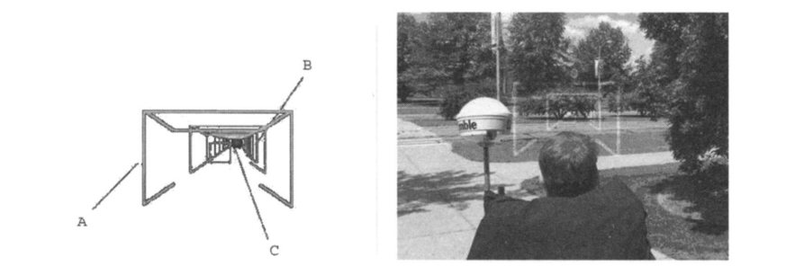

Directing Visual Attention with AR

[[Attention affected by Environment - All]]
[[Attention & Interfacing with Devices - All]]
[[Attention - All]]

Main approach:

Assumptions they use to achieve cognitive augmentation: Extended wireless network topology

Diagrams

[Article](https://www.tandfonline.com/doi/abs/10.2753/MIS0742-1222230408?casa_token=PXHug6pj6U4AAAAA:miysc_ERphWaHMeO3wXmedYLuyELmEp1n_5HQNStOEt9Llvr7qERegqfEELMebTWXefhY2bWFymP)

# The Attention Funnel

The evolution of mobile computing has created a more ubiquitous integration of physical space and digital information. [Radio frequency identification (RFID)](https://www.rfidinc.com/rfid-101/), geospatial data, and rich databases enable the further integration of the physical world and the virtual information that is flying through it.

To augment, and complement human attention with [augmented reality (AR)](https://www.fi.edu/what-is-augmented-reality), Biocca et. al have proposed a [system for implicit visuospatial cueing which supports a user in search and navigation](https://www-jstor-org.ezproxy.library.uvic.ca/stable/40398875?pq-origsite=summon&seq=1#metadata_info_tab_contents) labelled as the 'Attention Funnel'. Applicable scenarios include a warehose worker managing inventory, and searching for particular items in select aisles, to training repair technicians with an AR system to learn procedural repair steps and the tools used for them. AR enhances the real world and so may have more practical application that the related [virtualy reality (VR)](https://www.vrs.org.uk/virtual-reality/what-is-virtual-reality.html), where the environment is replaced by computer-generated imagery.

As mentioned in [[Attentive User Intefaces - Mahum]], attention is limited mental resource, and as such the Attention Funnel aims to reduce the mental load associated with attention that individuals are often burdened with. It targets AR capable devices and is composed of three basic components depicted in figure 1 below. These are
1. *A view plane:* A virtual bore-sight centered in the display to mark the centre of the pattern from the user's perspective
2. *Funnel planes:* A virtual set of planes (placed every 0.2 meters) directed towards the object the individual is seeking
3. *Crosshair:* A virtual crosshair centered on the object

|  |
|:--:|
| *Figure 1: * The Attention Funnel and its Components |
 [Image Source](https://www-tandfonline-com.ezproxy.library.uvic.ca/doi/pdf/10.2753/MIS0742-1222230408?needAccess=true)
 
 # Effectiveness

Studies of user performance suggest that AR systems can provide a unique benefit when compared to more common printed manuals in terms of task performance, decreasing rates of error, and decreasing the mental load on the individual. This system uses these principles, as motivation to design the Attention Funnel and assumes their credibility.

The system directs users to the target object in real space by drawing the funnel planes along Hermite Curves aimed at the target object. This forms a smooth path from the user's starting position, to the target location as depicted in Figure 2. This path is dynamically created, updating as the user moves regardless of which direction they move in, and takes in to account the orientation of the user's head, or device they are viewing the physical world through.

 |  |
 |:--:|
 | *Figure 2* | 
 [Image Source](https://www-tandfonline-com.ezproxy.library.uvic.ca/doi/pdf/10.2753/MIS0742-1222230408?needAccess=true)
 
 Figure 3 provides a real-world view of this functionality.
 
  |  |
 |:--:|
 | *Figure 3* | 
 [Image Source](https://www-tandfonline-com.ezproxy.library.uvic.ca/doi/pdf/10.2753/MIS0742-1222230408?needAccess=true)
 

The attention funnel was tested to establish its effectiveness on reducing mental load, error rate, and time to complete tasks. Subjects were placed within an omnidirectional workspace and were required to grab a target object after a starting audio cue as shown in Figure 4. This was done once with (1) the attention funnel, (2) once with visual highlighting techniques in typical AR systems which surrounded the object in a green, virtual box, and once (3) with a simple linguistic prompt as a control such as "pick up the orange scissors".

 |  |
 |:--:|
 | *Figure 4* | 
 [Image Source](https://www-tandfonline-com.ezproxy.library.uvic.ca/doi/pdf/10.2753/MIS0742-1222230408?needAccess=true)

The test found that the attention funnel decreased the visual search time by 22 percent overall, or approximately 28 percent for the visual search phase alone, and 14 percent over its next fastes

It also results indicate that the attention funnel interface has the lowest mental workload (M = 44.64, SD = 16.96), comparing to the visual highlight interface (M = 54.57, SD = 18.26) and the audio interface (M = 55.57, SD = 12.43).

The interface increased user's consistency by an average of 65 percent and 56 percent over the next best interface.

The results can be viewed graphically in Figure 5, and Figure 6 below.
 
 |  |
 |:--:|
 | *Figure 5* | 
 [Image Source](https://www-tandfonline-com.ezproxy.library.uvic.ca/doi/pdf/10.2753/MIS0742-1222230408?needAccess=true)
 
 |  |
 |:--:|
 | *Figure 6* | 
 [Image Source](https://www-tandfonline-com.ezproxy.library.uvic.ca/doi/pdf/10.2753/MIS0742-1222230408?needAccess=true)

# Assumptions

The attention funnel is dependant on technology capable of presenting 3D graphics, as well as their connection to a heterogeneous wireless network topology which enables users to access information anytime, and anywhere. These devices must be able to be 'seen through' with a camera that displays what is sees on the screen.

The attention funnel also requires target objects to be identifiable by either 3D virtual tracking, RFID markers, or spatial GPS coordinates. 

The location of target objects or locations in the environment may be known to the system because they are (1) virtual objects in tracked 3D space, (2) tagged with sensors such as visible markers or RFID tags, or (3) predefined spatial locations as in GPS coord

Objects tagged with RFID tags are not necessarily detectable at a distance, but local sensing in a facility may be sufficient to indicate a position that can be utilized for attention direction. 

In some cases, the location of the object is detected by sensors and is not known ahead of time. An implementation we are currently exploring involves the detection of visible markers with omnidirectional cameras, which can be implemented in a video see-through or optical see-through system.

ser.) The head-mounted omnidirectional camera detects markers in a 360-degree environment around the user. The relation of the camera to the user's viewpoint is known. Detected objects can be cued for the user based on task needs or search requests by the user.

Studies of user performance in AR-based information systems indicate that they can provide unique human factors benefits—as compared to approaches using traditional printed manuals or other computer-based approaches—such as improved task performance, decreased error rates, and decreased mental workload [34, 35, 36].

Information objects such as labels, overlays, 3D objects, and other information are integrated into the physical environment. Objects, tasks, and locations can be cued when appropriate to support navigation and mobile active user tasks.

Increased network access via heterogeneous wireless network topologies enables mobile users to have “anytime, anywhere” access of information for work and personal communication [6].

