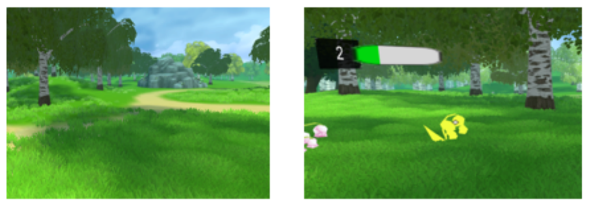

# Gamified Interaction with Virtual Nature
[Article](https://dl-acm-org.ezproxy.library.uvic.ca/doi/10.1145/3359996.3364708)

## Attention Restoration Theory
Attention Restoration Theory states that attention depleted by concentration-heavy tasks can be restored by alternating to a task that involves exposure to nature. This effect has been observed in multiple environments, such as looking at photos that contain nature and in virtual reality. However, virtual reality offers the additional benefit of complete control over the environment, allowing for interactions with virtual nature to be gamified (adding game design elements to a non-game scenario to improve engagement and motivation). The paper describes a small pilot study that was conducted to see if gamifying interaction with virtual nature improved attention restoration.

## Methodology
Participants completed a gamified and non-gamified virtual reality experience in a random order. Before both, they completed a mental arithmetic task to drain their attention to allow for possible restorative effects. After both the arithmetic task and the virtual reality experience, participants had their attention measured by doing the Sustained Attention to Response Task and the Zuckerman's Inventory of Personal Reactions. Figure 1 shows both experiences. The gamified one on the right involved picking up plants they found in the forest, gaining an increase in level and progress bar for each type of plant.

||
|:--:|
|Figure 1: The non-gamified and gamified virtual forests, on the left and right respectively.|

## Results
All participants experienced less commission errors (a measure of sustained attention) after the gamified interaction compared to the non-gamified interaction. The sample size of six is too small to draw any concrete conclusions, but still shows that the idea of using gamification to improve attention restoration is a promising one.